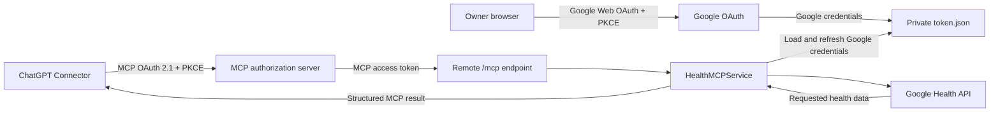

# Fitbit Health MCP

A single-user reference implementation that exposes read-only Google Health data to ChatGPT through a remote Model Context Protocol (MCP) server.

The project supports both local stdio MCP and remote Streamable HTTP MCP. The remote path separates ChatGPT authentication (MCP OAuth 2.1 Authorization Code with PKCE) from Google Health authorization (Google Web OAuth with PKCE), and is packaged for deployment on Render.

> This project is not a medical device and does not provide diagnosis, treatment, or medication advice.

## Architecture



The two OAuth boundaries are intentionally independent:

- **MCP OAuth** authenticates ChatGPT to the remote `/mcp` resource. Access and refresh tokens are opaque, stored as digests in process memory, and scoped to `health:read`.
- **Google OAuth** authorizes the server to read the owner's Google Health data. Google credentials are stored in `.private/token.json`; they are never issued to ChatGPT.

When a tool is called, the requested health data travels through the deployed MCP server and is returned to the connected ChatGPT conversation. Google OAuth credentials are not returned to ChatGPT.

## MCP tools

The same six tools are registered for stdio and Streamable HTTP:

- `get_sleep(days: int = 7)`
- `get_steps(days: int = 7)`
- `get_heart_rate(days: int = 7)`
- `get_resting_heart_rate(days: int = 7)`
- `get_hrv(days: int = 7)`
- `get_health_summary(days: int = 7)`

`days` accepts only `14`, `7`, `3`, or `1`; the default is `7`. Tool results use a stable JSON envelope containing `requested_days`, `available_days`, `data`, `missing_data`, and `diagnostics`.

## Requirements and installation

- Python 3.12 or newer
- A Google Cloud project with the required read-only Google Health scopes
- A Desktop OAuth client for local CLI/stdio authorization, or a Web OAuth client for the remote bootstrap flow

```powershell
python -m pip install -e ".[test]"
```

OAuth client files, tokens, private data, generated reports, environment files, and logs are excluded by `.gitignore`. Never commit real credentials or health data.

## Local CLI and stdio MCP

Place a Google Desktop OAuth client JSON in the project root using a name matched by `client_secret_*.json`, then authorize and synchronize:

```powershell
python -m fitbit_health sync --days 7
```

The local flow opens a temporary localhost callback and stores the resulting Google authorized-user credentials in `.private/token.json`.

Start the stdio MCP server with either command:

```powershell
fitbit-health-mcp
python -m fitbit_health.mcp_server
```

Generic Codex configuration:

```toml
[mcp_servers.fitbit_health]
command = "python"
args = ["-m", "fitbit_health.mcp_server"]
cwd = "/path/to/fitbit-health-mcp"
```

## Remote MCP and ChatGPT Connector

The remote entry point is:

```powershell
python -m fitbit_health.http_mcp_server
```

It exposes:

- `/mcp` — authenticated Streamable HTTP MCP
- `/.well-known/oauth-protected-resource` — protected-resource metadata
- `/.well-known/oauth-authorization-server` — authorization-server metadata
- `/oauth/authorize` and `/oauth/token` — MCP OAuth authorization code, PKCE, and refresh flow
- `/auth/google` and `/oauth2/callback` — owner-only Google Web OAuth bootstrap

To connect from ChatGPT, deploy the server over HTTPS, configure the fixed public MCP client ID and ChatGPT redirect URI, then add the deployment's `/mcp` URL as a custom connector. ChatGPT discovers the OAuth metadata and six tools from that endpoint.

The current implementation uses an owner password at `/oauth/authorize`. Use a unique random value and do not reuse the Google bootstrap password.

## Render deployment

[`render.yaml`](render.yaml) defines a single free-plan Python Web Service that installs the package and runs the remote MCP entry point. Render terminates TLS; the app binds to `0.0.0.0:$PORT` and keeps the MCP resource at `/mcp`.

Create these Render Secret Files with the exact filenames shown:

| Secret file | Purpose |
| --- | --- |
| `/etc/secrets/client_secret_render.json` | Google Web OAuth client configuration |
| `/etc/secrets/token.json` | Optional seed for the runtime Google token |

Configure the following environment variables. Values shown in `render.yaml` are deployment defaults; every password, client identifier, redirect URI, and secret must be set for the actual deployment.

| Variable | Purpose |
| --- | --- |
| `MCP_OAUTH_ISSUER_URL` | Public HTTPS origin of the authorization server |
| `MCP_OAUTH_RESOURCE_URL` | Exact public `/mcp` resource URL |
| `MCP_OAUTH_CLIENT_ID` | Pre-registered ChatGPT public client ID |
| `MCP_OAUTH_REDIRECT_URI` | Exact ChatGPT connector callback URI |
| `MCP_OAUTH_OWNER_PASSWORD` | Owner login for MCP authorization |
| `OAUTH_BOOTSTRAP_PASSWORD` | Owner login for `/auth/google` |
| `OAUTH_COOKIE_SECRET` | Random signing key for the Google OAuth state session |
| `GOOGLE_OAUTH_REDIRECT_URI` | Exact deployment `/oauth2/callback` URI registered with Google |
| `FITBIT_HEALTH_CLIENT_SECRET_PATH` | Google Web OAuth client Secret File path |
| `FITBIT_HEALTH_TOKEN_PATH` | Writable runtime Google token path |
| `FITBIT_HEALTH_TOKEN_SEED_PATH` | Read-only Google token seed path |
| `MCP_BEARER_TOKEN` | Required legacy compatibility token in the current release |

After deployment, visit `/auth/google` over HTTPS and complete the owner-protected Google authorization flow. The callback writes the authorized-user credentials to the runtime token path.

## Token lifecycle

| Credential | Purpose | Current storage |
| --- | --- | --- |
| Google access/refresh token | Server access to Google Health | Writable `.private/token.json` |
| Google token seed | Restore the runtime token when it is absent | Render Secret File |
| MCP access/refresh token | ChatGPT access to `/mcp` | Digests in process memory |
| Legacy static bearer | Backward-compatible direct `/mcp` access | Render environment secret |

Important operational behavior:

- Render's free service does not provide a persistent disk. A restart, cold start, or redeploy may discard the writable Google token and restore the older Secret File seed.
- If Google issues a new refresh token, update the seed through Render's secret management. Otherwise a later rebuild may restore an obsolete token.
- MCP access and refresh tokens are in memory. A process restart invalidates them and ChatGPT may need to authorize or reconnect the connector.
- A Google OAuth project in Testing status may issue refresh tokens with a limited lifetime. Reauthorize through `/auth/google` when Google authorization is no longer available.

## Security model

- Google scopes are read-only.
- MCP authorization codes are single-use, short-lived, and stored only as hashes.
- MCP access and refresh tokens are opaque; refresh tokens rotate and token material is stored only as digests.
- MCP access tokens are bound to the configured `/mcp` resource and `health:read` scope.
- Google Web OAuth uses state validation, PKCE, a signed `Secure`/`HttpOnly` session cookie, and an owner-protected bootstrap route.
- Authentication failures are handled before health tools load Google credentials.
- Tests use synthetic data and do not contain real health records.

### Legacy bearer compatibility

The current remote startup still requires `MCP_BEARER_TOKEN` and accepts it alongside MCP OAuth access tokens. This is a long-lived, high-privilege compatibility path. For a production hardening release, add an explicit setting such as `ENABLE_LEGACY_BEARER=false` by default and enable the legacy verifier only when that flag is intentionally set. This release-preparation change does not alter or remove the legacy code path.

### Known OAuth compliance gap

The authorization request validates the MCP `resource`, but the current token endpoint does not yet require and validate RFC 8707 `resource` on authorization-code and refresh-token requests. The project therefore does not claim full MCP 2025-11-25 authorization compliance. Address this in a separately scoped security change before treating the service as production hardened.

## Known limitations

- Single user and single tenant; this is a reference implementation, not a SaaS platform.
- Read-only health access; no write operations are provided.
- Only `14`, `7`, `3`, and `1` day request windows are supported.
- MCP OAuth tokens are not durable across process restarts.
- Render Free runtime files are ephemeral.
- Google OAuth Testing policy may require periodic reauthorization.
- Windows does not receive the same token-file permission hardening as POSIX systems.
- Health data returned by a tool is sent through Render to the connected ChatGPT conversation.
- No medical diagnosis or clinical reliability is claimed.

## Tests

```powershell
python -m pytest -q
python -m compileall -q src tests
```

## License

Released under the [MIT License](LICENSE).
