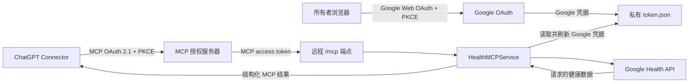

# Fitbit Health MCP

这是一个单用户参考实现，用 Remote MCP Server 将只读的 Google Health 数据接入 ChatGPT。

项目同时支持本地 stdio MCP 和远程 Streamable HTTP MCP。远程模式使用两套相互独立的授权流程：ChatGPT 通过 MCP OAuth 2.1 Authorization Code + PKCE 访问 `/mcp`，服务端通过 Google Web OAuth + PKCE 获取 Google Health 的只读权限。项目已提供 Render 部署配置。

> 本项目不是医疗设备，不提供诊断、治疗或用药建议。

## 架构



两套 OAuth 各自处理不同的授权关系：

- MCP OAuth 负责验证 ChatGPT 是否可以访问远程 `/mcp`。Access token 和 refresh token 均为 opaque token，只以摘要形式保存在进程内存中，scope 为 `health:read`。
- Google OAuth 负责授权服务端读取所有者的 Google Health 数据。Google 凭据保存在 `.private/token.json`，不会签发或发送给 ChatGPT。

调用工具时，请求的健康数据会经过部署的 MCP Server，并返回到已连接的 ChatGPT 会话。Google OAuth 凭据不会出现在工具结果中。

## MCP 工具

stdio 和 Streamable HTTP 共用以下六个工具：

- `get_sleep(days: int = 7)`
- `get_steps(days: int = 7)`
- `get_heart_rate(days: int = 7)`
- `get_resting_heart_rate(days: int = 7)`
- `get_hrv(days: int = 7)`
- `get_health_summary(days: int = 7)`

`days` 只接受 `14`、`7`、`3`、`1`，默认值为 `7`。工具统一返回 JSON 对象，其中包含 `requested_days`、`available_days`、`data`、`missing_data` 和 `diagnostics`。

## 环境要求与安装

- Python 3.12 或更高版本
- 已启用所需 Google Health 只读 scope 的 Google Cloud 项目
- 本地 CLI/stdio 使用 Desktop OAuth 客户端；远程授权入口使用 Web OAuth 客户端

```powershell
python -m pip install -e ".[test]"
```

`.gitignore` 已排除 OAuth 客户端文件、token、私有健康数据、生成报告、环境文件和日志。不要提交真实凭据或健康记录。

## 本地 CLI 与 stdio MCP

将 Google Desktop OAuth 客户端 JSON 放在项目根目录，文件名需要匹配 `client_secret_*.json`。然后运行同步命令完成授权：

```powershell
python -m fitbit_health sync --days 7
```

本地授权会启动一个临时 localhost 回调。授权成功后，Google authorized-user 凭据保存在 `.private/token.json`。

可以用以下任一命令启动 stdio MCP Server：

```powershell
fitbit-health-mcp
python -m fitbit_health.mcp_server
```

通用 Codex 配置示例：

```toml
[mcp_servers.fitbit_health]
command = "python"
args = ["-m", "fitbit_health.mcp_server"]
cwd = "/path/to/fitbit-health-mcp"
```

## Remote MCP 与 ChatGPT Connector

远程服务入口为：

```powershell
python -m fitbit_health.http_mcp_server
```

服务暴露以下端点：

- `/mcp`：需要认证的 Streamable HTTP MCP
- `/.well-known/oauth-protected-resource`：Protected Resource Metadata
- `/.well-known/oauth-authorization-server`：Authorization Server Metadata
- `/oauth/authorize` 和 `/oauth/token`：MCP OAuth Authorization Code、PKCE 与 token refresh
- `/auth/google` 和 `/oauth2/callback`：仅供所有者使用的 Google Web OAuth 授权入口

连接 ChatGPT 时，先将服务部署到 HTTPS，再配置固定的 MCP public client ID 和 ChatGPT redirect URI。随后在 ChatGPT 中将部署地址的 `/mcp` URL 添加为自定义 Connector。ChatGPT 会通过该地址发现 OAuth metadata 和六个工具。

当前 `/oauth/authorize` 使用所有者密码。请使用独立生成的随机密码，不要与 Google OAuth bootstrap 密码复用。

## Render 部署

[`render.yaml`](render.yaml) 定义了一个单实例的 Render Free Python Web Service。部署时安装当前 Python package，并运行 Remote MCP 入口。Render 负责 TLS termination，应用监听 `0.0.0.0:$PORT`，MCP 路径保持为 `/mcp`。

需要创建以下 Render Secret Files，文件名必须完全一致：

| Secret File | 用途 |
| --- | --- |
| `/etc/secrets/client_secret_render.json` | Google Web OAuth 客户端配置 |
| `/etc/secrets/token.json` | 可选的 Google runtime token 种子 |

还需要配置下列环境变量。`render.yaml` 中已有部分部署默认值，密码、client ID、redirect URI 和 secret 必须按实际环境填写。

| 环境变量 | 用途 |
| --- | --- |
| `MCP_OAUTH_ISSUER_URL` | MCP 授权服务器的公网 HTTPS origin |
| `MCP_OAUTH_RESOURCE_URL` | 完整且精确的公网 `/mcp` resource URL |
| `MCP_OAUTH_CLIENT_ID` | 预注册的 ChatGPT public client ID |
| `MCP_OAUTH_REDIRECT_URI` | ChatGPT Connector 的精确回调地址 |
| `MCP_OAUTH_OWNER_PASSWORD` | MCP 授权页面的所有者密码 |
| `OAUTH_BOOTSTRAP_PASSWORD` | `/auth/google` 的所有者密码 |
| `OAUTH_COOKIE_SECRET` | Google OAuth state session 的随机签名密钥 |
| `GOOGLE_OAUTH_REDIRECT_URI` | 已在 Google 注册的部署端 `/oauth2/callback` 地址 |
| `FITBIT_HEALTH_CLIENT_SECRET_PATH` | Google Web OAuth 客户端 Secret File 路径 |
| `FITBIT_HEALTH_TOKEN_PATH` | 可写的 Google runtime token 路径 |
| `FITBIT_HEALTH_TOKEN_SEED_PATH` | 只读的 Google token 种子路径 |
| `MCP_BEARER_TOKEN` | 当前版本仍然要求提供的 legacy compatibility token |

部署完成后，通过 HTTPS 访问 `/auth/google`，输入 bootstrap 凭据并完成 Google 授权。回调会将 authorized-user 凭据写入 runtime token 路径。

## Token 生命周期

| 凭据 | 用途 | 当前存储位置 |
| --- | --- | --- |
| Google access/refresh token | 服务端访问 Google Health | 可写的 `.private/token.json` |
| Google token 种子 | runtime token 不存在时进行恢复 | Render Secret File |
| MCP access/refresh token | ChatGPT 访问 `/mcp` | 进程内存中的摘要 |
| Legacy static bearer | 兼容旧的 `/mcp` 直接访问方式 | Render 环境变量 secret |

部署时需要了解以下行为：

- Render Free 不提供持久磁盘。重启、冷启动或重新部署后，可写的 Google token 可能丢失，服务会尝试从 Secret File 种子恢复。
- 如果 Google 签发了新的 refresh token，需要同步更新 Render 中的 token 种子。否则后续重建可能恢复已经失效的旧 token。
- MCP access token 和 refresh token 只保存在内存中。进程重启后这些 token 会失效，ChatGPT 可能需要重新授权或重新连接 Connector。
- Google OAuth 项目处于 Testing 状态时，refresh token 可能有较短的有效期。Google 授权失效后，需要重新通过 `/auth/google` 授权。

## 安全模型

- Google scope 全部为只读权限。
- MCP authorization code 只能使用一次、有效期较短，并且只存储哈希。
- MCP access token 和 refresh token 均为 opaque token。Refresh token 会轮换，token 内容只以摘要形式存储。
- MCP access token 绑定到配置的 `/mcp` resource 和 `health:read` scope。
- Google Web OAuth 使用 state 校验、PKCE、带签名的 `Secure`/`HttpOnly` session cookie，以及受所有者密码保护的授权入口。
- 认证失败时，服务会在健康工具读取 Google 凭据前拒绝请求。
- 测试使用合成数据，不包含真实健康记录。

### Legacy bearer 兼容模式

当前远程入口仍然要求设置 `MCP_BEARER_TOKEN`，并同时接受该 token 和 MCP OAuth access token。这是一条长期、权限较高的兼容通道。

后续生产加固版本应增加显式配置，例如默认设置 `ENABLE_LEGACY_BEARER=false`，只有管理员主动开启时才加载 legacy verifier。当前 v0.1.0 release preparation 不修改或删除这段兼容代码。

### 已知 OAuth 合规缺口

Authorization request 已校验 MCP `resource`，但当前 token endpoint 尚未强制要求并校验 Authorization Code 和 Refresh Token 请求中的 RFC 8707 `resource` 参数。因此，本项目不宣称完全符合 MCP 2025-11-25 authorization specification。在将服务标记为 production hardened 前，应通过单独的安全变更补齐该校验。

## 已知限制

- 当前只支持单用户、单租户，不是 SaaS 平台。
- 只提供健康数据读取，不提供写入操作。
- 请求窗口仅支持 `14`、`7`、`3`、`1` 天。
- MCP OAuth token 无法跨进程重启保留。
- Render Free 的 runtime 文件是临时文件。
- Google OAuth Testing policy 可能要求定期重新授权。
- Windows 上的 token 文件权限保护弱于 POSIX 系统。
- 工具返回的健康数据会经过 Render，并发送到已连接的 ChatGPT 会话。
- 本项目不提供医学诊断，也不承诺临床可靠性。

## 测试

```powershell
python -m pytest -q
python -m compileall -q src tests
```

测试只使用合成数据，不包含真实健康记录。

## License

本项目使用 [MIT License](LICENSE)。
